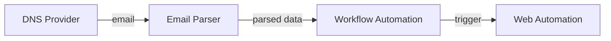

# No-IP domain renewal automation


# Goal
No-IP free domains expire every month, to keep them you should activate via webpage. The goal is to fully automate this task.

Alternative: change to free dynamic [DNS provider](https://www.nsupdate.info/)

# Tools
- Gmail: notification letter about activation received in mail
- Web automation tool: login to webpage and executes activation
- Workflow automation tool: connects trigger with script execution


# Solution diagram



# Execution

You can build a Docker container and execute with

```
docker build -t activate

docker run -it --rm -e USERNAME=<USER> -e PASSWORD=<PASS> activate 
```
